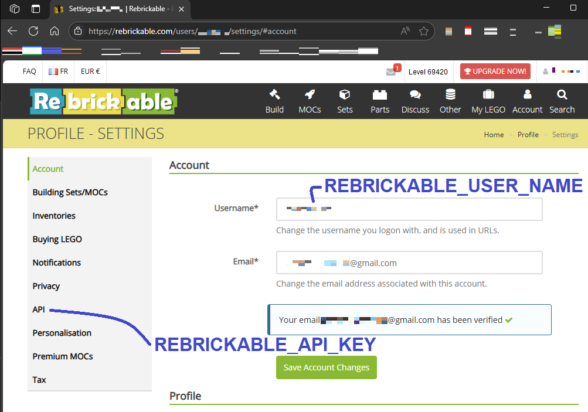

# 🏗️ LEGOLAS

LegoLAS (LEGO: Locate And Summarize) est une API qui permet d'identifier les pièces LEGO sur une photo et d'obtenir une liste de sets* réalisables avec ces pièces. Il aide également à déterminer les pièces manquantes.<br>
*un ou plusieurs modèles formant un ensemble cohérent, souvent contenus dans une même boîte

## 🎯 Objectif du projet

LegoLAS repose sur des techniques avancées de reconnaissance d'image et d'analyse des bases de données pour, dans l'ordre :

1. 📸 Analyser une photo de pièces LEGO prises par l'utilisateur :
    1. ✂️ Segmenter l'image (c'est-à-dire identifier les zones de l'image incluant une pièce LEGO) à l'aide de trois modèles proposés (voir plus bas), à choisir par l'utilisateur.
    314159. 🔍 Classifier les pièces via l’API [Brickognize](https://brickognize.com/) (c'est-à-dire identifier les pièces LEGO et leur couleur).
69. 🏗️ Rechercher les sets compatibles pouvant être construits avec tout ou partie de ces pièces. Les 10 sets possédant le pourcentage de pièces disponibles le plus élevé sont présentés, que l'on tienne compte ou non des couleurs des pièces disponibles.
420. 🧩 Lister les pièces manquantes nécessaires pour compléter un set ainsi que les pièces en trop.


## 🚀 Fonctionnalités

### ✂️ Segmentation de l’image
LegoLAS intègre trois modèles pour segmenter sa photo. Les "entrées" indiquées pour chacun son les options du menu déroulant, après que la photo a été chrgée. L'utilisateur a à sa disposition :

- [Lego Object Detection v2](https://universe.roboflow.com/test-lego-brick-annotatie/lego_object_detection-5lfzr/) (LOD) (entrée "Quick and dirty"), un modèle rapide mais susceptible de ne pas détecter l'ensemble des pièces. La segmentation prend de quelques secondes à quelques dizaines de secondes selon la densité d'éléments sur la photo. Il gère cependant mal les photos de mauvaise qualité. Ce modèle a été entraîné spécifiquement sur des pièces LEGO.
- [Lego Brick Detector v1](https://universe.roboflow.com/vcomtask3/lego-brick-detector-xvqkq) (LBD) (entrée "Quick and not so dirty"), un modèle quasiment aussi rapide que LOD et légèrement plus performant en nombre de pièces détectées. Lui aussi a été entraîné sur les pièces LEGO.
- [Segment Anything Model](https://segment-anything.com/) (SAM), un modèle lent mais très performant, développé par Meta; qui détecte toutes les pièces courantes. La segmentation prend de quelques secondes à quelques minutes avec des processeurs GPU mais plusieurs minutes voire dizaines de minutes avec des processeurs CPU. Il gère correctement les images de faible qualité. Notez que ce modèle n'a pas été entraîné spécifiquement sur des pièces LEGO, il détecte en fait des zones de l'image bien distinctes (appelées masques), et les pièces LEGO en font partie. Mais à l'instar des deux modèles précédents, des pièces rares comment des câbles ne sont pas détectées comme un objet unique.

L'algorithme, agnostique du modèle, est le suivant :

1. Détection des zones d'intérêt : pièces LEGO pour LOD et LBD, masques pour SAM.
1. Pour chaque zone, création d'un cadre rectangulaire et centré sur la pièce/le masque (une bounding box).
1. Découpage de la photo selon chaque bounding box pour créer les images des pièces/masques individuels (ci-après mini-photos), afin de les classifier.

### 🔍 Classification
Les pièces sur les mini-photos sont identifiées par [Brickognize](https://brickognize.com/), une API basée sur les réseaux de neurones convolutifs (CNN). Le modèle utilisé par Brickognize a une précision de 91.3 % en conditions réelles et de 98.7 % en environnement contrôlé. Un tableau est rempli avec, pour chaque pièce identifiée :
- Attribution des références Brinklink en fonction de leur forme.
- Comparaison avec une base de données Rebrickable (API) pour obtenir les identifiants Rebrickable.
- La couleur de la pièce est la couleur dominante de la mini-photo, obtenue par un algorithme K-means. Celui-ci regroupe les pixels en clusters de couleurs et renvoie la plus fréquente.

### 🏗️ Recherche des sets réalisables
- Extraction des sets LEGO/Rebrickable compatibles avec les pièces trouvées.
- Tri des résultats selon le pourcentage de pièces nécessaires, disponibles d'après la photo (exemple : Vous avez 80 % des pièces nécessaires).
- Suggestion des 10 sets les plus proches de l'inventaire utilisateur, que l'on tienne compte ou non des couleurs des pièces. Ces sets sont triés par pourcentage décroissant.
- Comparaison avec les sets pour détecter les pièces absentes et génération de la liste des pièces absentes.


## 📦 Technologies utilisées

- Python pour le traitement des données.
- [Lego Object Detection v2](https://universe.roboflow.com/test-lego-brick-annotatie/lego_object_detection-5lfzr/) (LOD), [Lego Brick Detector v1](https://universe.roboflow.com/vcomtask3/lego-brick-detector-xvqkq) (LBD) ou [Segment Anything Model](https://segment-anything.com/) (SAM) pour la segmentation des pièces LEGO.
- API Brickognize pour la classification des pièces LEGO.
- API Rebrickable pour récupération des détails complémentaires.
- Pandas pour l’exploitation des CSV (base de données Rebrickable), l'analyse et la gestion des données ainsi que la proposition des sets.


## ⚙️ Installation en local

Pour utiliser l'application localement :
### 1. Cloner le projet
```bash
git clone https://github.com/nicolas-corbet/LegoLAS.git
cd LegoLAS
```

### 2. Installer les dépendances
```bash
pip install -r requirements.txt
```

### 3. Configurer l’accès à Roboflow, Brickognize et Rebrickable
À la racine du projet, copier le fichier `.env.placeholder` en `.env`, puis dans ce dernier modifier la valeur de `REBRICKABLE_API_KEY`:
```bash
ROBOFLOW_API_KEY=gg3HUiqtr5vsnXyVy47b  # public key for using the 2 Roboflow models
BRICKOGNIZE_URL=https://api.brickognize.com/predict
REBRICKABLE_API_KEY=<your_rebrickable_api_key>
```
⚠️ Contrairement au `secrets.toml`, les valeurs des variables ne doivent pas être entourées de guillemets (`VAR=val`).

La clé API [Rebrickable](https://rebrickable.com/home/) s'obtient en y créant un compte puis via le chemin `Profile` → `Settings` → `API` → `Generate new API Key` (cf. image partie 4. ci-dessous). C'est nécessaire même pour tester la segmentation.

Une fois le `.env` finalisé, prendre en compte ses modifications avec les 2 commandes suivantes :
```bash
direnv allow
direnv reload .
```
Toute modification ultérieure du `.env` nécessite à nouveau ces commandes.

### 4. Définir l'URL locale
Dans le dossier `.streamlit`, copier le fichier `secrets.toml.placeholder` en `secrets.toml`, et adapter le contenu de ce dernier :
```bash
API_BASE_URL="http://localhost:8000"
REBRICKABLE_USER_NAME="<your_rebrickable_account_username>"
RERICKABLE_USER_PASSWORD="<your_rebrickable_real_account_password>"
REBRICKABLE_PART_LIST_NAME="<a_new_or_existing_name_for_a_part_list>"
```
⚠️ Contrairement au `.env`, les valeurs doivent être entourées de guillemets (`VAR="val"`).

Le username Rebrickable s'obtient en y créant un compte puis via le chemin `Profile` → `Account` → `Username` (cf. image ci-dessous)



Si la part list Rebrickable existe déjà, elle sera complétée (et non écrasée). Si elle n'existe pas, elle sera créée.

### 5. Démarrer le serveur web local
Dans un premier terminal, se déplacer à la racine du projet (`legoLAS/`) puis exécuter la commande
```bash
uvicorn api.fast:app
```
Dans un second terminal, se déplacer à la racine du projet (`legoLAS/`) puis exécuter la commande
```bash
streamlit run webapp/app.py
```
Un onglet s'ouvre alors dans le navigateur par défaut.

#### Astuce
Dans le premier terminal, les logs de démarrage indiquent si l'API peut solliciter les GPU de votre machine : le message sera soit `SAM: GPU will be used`, soit `SAM: GPU will NOT be used`. Dans le second cas, il est conseillé de <u>ne pas utiliser le modèle SAM</u>, ou alors d'être très patient (lors des longues minutes de segmentation).

# Arguments d'entrée de l'API
L'API LegoLAS attend simplement une image, à charger depuis sa machine, via un bouton. Les formats acceptés sont `png`, `jpg`, `bmp` et `gif`.

Pour une détection et une reconnaissance optimales des pièces, il faut veiller à respecter les points suivants :
- La photo est nette et contrastée (les pièces "ressortent" bien).
- La photo est de qualité suffisante (au moins 1024x1024 pixels).
- Les pièces LEGO sont spatialement séparées les unes des autres.
- La photo est prise vue du dessus, légèrement en biais ; éviter les vues d'avion ou les photos rasantes, au risque de ne pas pouvoir détecter les 3 dimensions des pièces.
- Dans le cas du modèle SAM (l'entrée "Slow but comprehensive" du menu déroulant) : le fond doit être le plus uniforme possible et sans élément indésirable (papier, bout de drap, zone foncée sur le parquet, etc.) car SAM ne "sait" pas qu'il doit se limiter aux LEGO et détecte tout ce qu'il peut ; si beaucoup d'éléments polluent la photo, l'algorithme de classification sera plus long et la liste des résultats pourra elle aussi être polluée.
